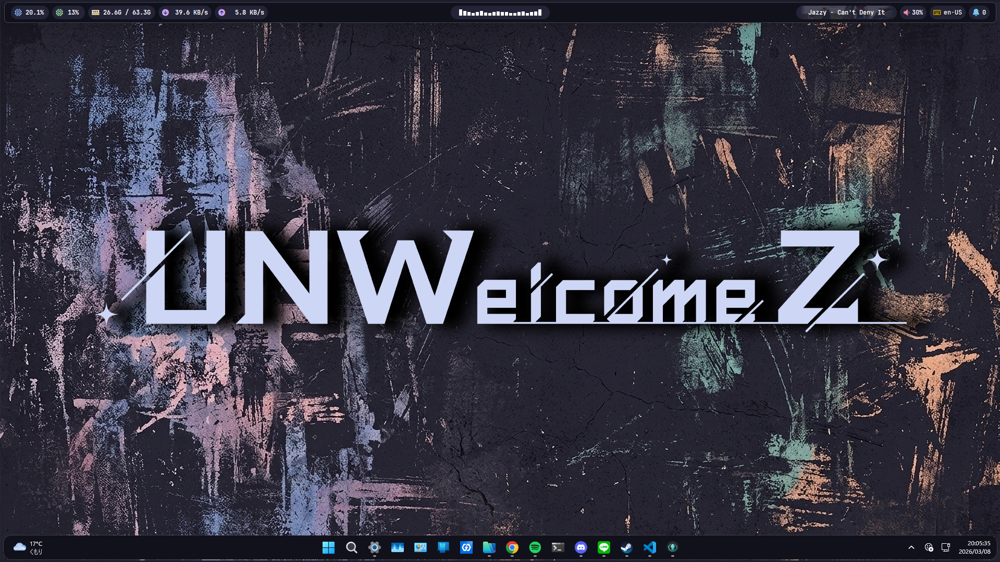

# windots
自用 Windows 桌面美化設定，以 [Catppuccin](https://catppuccin.com/) 風格設計

<div align="center">
  
</div>

## 使用工具
- [Windhawk](https://windhawk.net/) - Windows 的模組化修改工具
- [YASB Reborn](https://github.com/amnweb/yasb) - 頂部狀態列
- [Cava](https://github.com/karlstav/cava) - 音樂視覺化

## 安裝
> [!WARNING]
> Cava 安裝後執行時可能會發生找不到 `SDL2.dll` 錯誤  
> 需要手動修改 `PATH` 系統變數，增加 `%LOCALAPPDATA%\Microsoft\WinGet\Packages\karlstav.cava_Microsoft.Winget.Source_8wekyb3d8bbwe`

- Windhawk
  - 下載並安裝 [Windhawk](https://windhawk.net/download)
  - 安裝模組
    - `Taskbar tray system icon tweaks`
    - `Windows 11 Notification Center Styler`
    - `Windows 11 Taskbar Styler`
- YASB Reborn
  - 到 [Nerd Fonts](https://www.nerdfonts.com/font-downloads) 下載並安裝字型 `JetBrainsMono NFP`
  - 下載並安裝 [YASB Reborn](https://github.com/amnweb/yasb)
- Cava
  ```bash
  winget install karlstav.cava
  ```
- 複製檔案到對應位置
  - `yasb` 資料夾內容移動到 `%USERPROFILE%\.config\yasb`
  - `windhawk` 內每個檔案對應不同模組設定，複製貼上到各模組的 `進階 > 模組設定`

## 其他設定
- Windows 主色 `#1e1e2e`

## 其他工具
- [Files](https://files.community/) - 檔案總管替代工具，建議下載 Preview 版
- [Raycast for Windows](https://www.raycast.com/windows) - 指令啟動器

## Catppuccin
- [Catppuccin Cursors](https://www.deviantart.com/niivu/art/Catppuccin-Cursors-921387705): 非官方滑鼠樣式
- [catppuccinifier](https://github.com/lighttigerXIV/catppuccinifier): 圖片轉 Catppuccin 風格
- [Catppuccin for Files](https://github.com/catppuccin/windows-files): Files 主題
- [Catppuccin for Raycast](https://github.com/catppuccin/raycast): Raycast 主題，需要要付費 Pro 會員，目前 Windows 版還不支援
- [Catppuccin Chrome Theme - Mocha](https://chromewebstore.google.com/detail/catppuccin-chrome-theme-m/bkkmolkhemgaeaeggcmfbghljjjoofoh): Chrome 主題
- [Catppuccin for Web File Explorer Icons](https://chromewebstore.google.com/detail/catppuccin-for-web-file-e/lnjaiaapbakfhlbjenjkhffcdpoompki?hl=zh-TW): Chrome 主題
- [Catppuccin Userstyles](https://userstyles.catppuccin.com/): 網頁樣式，需要 [Stylus](https://chromewebstore.google.com/detail/stylus/clngdbkpkpeebahjckkjfobafhncgmne)
- [Catppuccin for Spicetify](https://github.com/catppuccin/spicetify): Spotify 主題，需要 [Spicetify](https://spicetify.app/)
- [Catppuccin for Discord](https://github.com/catppuccin/discord): Discord 主題，需要 [BetterDiscord](https://betterdiscord.app/)
- [Catppuccin for VSCode](https://marketplace.visualstudio.com/items?itemName=Catppuccin.catppuccin-vsc): VSCode 色彩佈景主題
- [Catppuccin Icons for VSCode](https://marketplace.visualstudio.com/items?itemName=Catppuccin.catppuccin-vsc-icons): VSCode 檔案圖示佈景主題
- [Catppuccin for Windows Terminal](https://github.com/catppuccin/windows-terminal): Windows Terminal 主題
- [Adwaita for Steam](https://steambrew.app/theme?id=7dzdgNotKWgNmQYXc6A0): Steam 主題，需要 [Millennium](https://steambrew.app/)