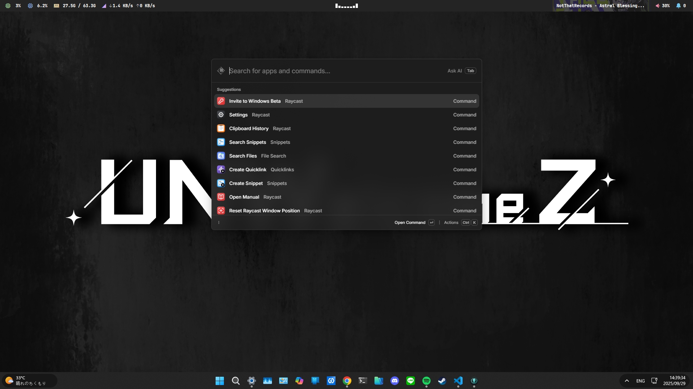

# windots
自用 Windows 桌面美化設定

<div align="center">
  
</div>

## 使用工具
- [Windhawk](https://windhawk.net/) - Windows 的模組化修改工具
- [YASB Reborn](https://github.com/amnweb/yasb) - 頂部狀態列
- [Cava](https://github.com/karlstav/cava) - 音樂視覺化

## 安裝
> [!WARNING]
> Cava 安裝後執行時可能會發生找不到 `SDL2.dll` 錯誤  
> 需要手動修改 `PATH` 系統變數，增加 `%LOCALAPPDATA%\Microsoft\WinGet\Packages\karlstav.cava_Microsoft.Winget.Source_8wekyb3d8bbwe`

- Windhawk
  - 下載並安裝 [Windhawk](https://windhawk.net/download)
  - 安裝 `Taskbar tray system icon tweaks` 模組
  - 安裝 `Windows 11 Notification Center Styler` 模組
  - 安裝 `Windows 11 Taskbar Styler` 模組
- YASB Reborn
  - 到 [Nerd Fonts](https://www.nerdfonts.com/font-downloads) 下載並安裝字型 `JetBrainsMono NFP`
  - 下載並安裝 [YASB Reborn](https://github.com/amnweb/yasb)
  - 使用 Winget 安裝 [Cava](https://github.com/karlstav/cava)  
    ```bash
    winget install karlstav.cava
    ```
- 複製檔案到對應位置
  - `yasb` 資料夾內容移動到 `%USERPROFILE%\.config\yasb`
  - `windhawk` 內每個檔案對應不同模組設定，複製貼上到各模組的 `進階 > 模組設定`

## 其他推薦
- [Files](https://files.community/) - 檔案總管替代工具，建議下載 Preview 版
- [Raycast for Windows](https://www.raycast.com/windows) - 啟動器，目前 Windows 版需要加入等候名單
